```plantuml
@startuml
skinparam classAttributeIconSize 0

interface "NetworkCallback<T>" as NetworkCallbackT
abstract class "NetResult<T>" as NetResultT
class "NetResult.Success<T>" as NetResultSuccessT
class "NetResult.Error<T>" as NetResultErrorT

class NetworkManager {
  - requestExecutor : ExecutorService
  - requestQueue : BlockingQueue<RequestTask>
  - mainHandler : Handler
  - responseHandler : ResponseHandler
  - connectionFactory : IHttpConnectionFactory
  - basePath : String
  + get(...)
  + post(...)
  + put(...)
  + patch(...)
  + delete(...)
  + upload(...)
}

abstract class "ACommand" as ACommand
class "GetCommand" as GetCommand
class "PostCommand" as PostCommand
class "PutCommand" as PutCommand
class "PatchCommand" as PatchCommand
class "DeleteCommand" as DeleteCommand
class "MultipartCommand" as MultipartCommand

interface "IHttpConnection" as IHttpConnection
class "HttpConnectionAdapter" as HttpConnectionAdapter
class "HttpsConnectionAdapter" as HttpsConnectionAdapter
interface "IHttpConnectionFactory" as IHttpConnectionFactory
class "HttpUrlConnectionFactory" as HttpUrlConnectionFactory

class "ResponseHandler" as ResponseHandler
interface "IResponseParser" as IResponseParser
class "GsonResponseParser" as GsonResponseParser

class "UrlBuilder" as UrlBuilder
class "NetworkConfig" as NetworkConfig
class "RequestCancelledException" as RequestCancelledException

NetworkCallbackT : + onResult(result : NetResultT)
NetResultSuccessT --|> NetResultT
NetResultErrorT   --|> NetResultT

NetworkManager o-- ResponseHandler
NetworkManager o-- IHttpConnectionFactory
NetworkManager --> ACommand
NetworkManager ..> NetResultT

ResponseHandler o-- IResponseParser
GsonResponseParser ..|> IResponseParser

ACommand ..> IHttpConnection
ACommand ..> NetworkConfig
ACommand ..> NetResultT

HttpUrlConnectionFactory ..|> IHttpConnectionFactory
HttpUrlConnectionFactory --> HttpConnectionAdapter
HttpUrlConnectionFactory --> HttpsConnectionAdapter

HttpConnectionAdapter ..|> IHttpConnection
HttpsConnectionAdapter ..|> IHttpConnection

GetCommand --|> ACommand
PostCommand --|> ACommand
PutCommand --|> ACommand
PatchCommand --|> ACommand
DeleteCommand --|> ACommand
MultipartCommand --|> ACommand

NetworkManager o-- "RequestTask" : contains
@enduml
```

# Android Clean Network Layer 🚀

This repository provides a robust and clean network layer implementation for Android applications, designed with modularity, testability, and maintainability in mind. It avoids third-party HTTP libraries, relying purely on **HttpURLConnection** for core network operations.

---

## 📦 Packaging
This repository is **source-first**.  
You can integrate it into your project by copying the `lib` module directly into your project's `app/src/main/java/` directory or by packaging it as an AAR (Android Archive) and including it as a dependency.

---

## ✨ Features
- **No third-party HTTP libs:** Built entirely using pure `HttpURLConnection` for core networking.  
- **Producer–Consumer queue (bounded):** Prevents Out Of Memory (OOM) errors under heavy load by limiting concurrent requests.  
- **Cancellation:** Every network call returns a `RequestHandle` allowing you to cancel ongoing requests with `.cancel()`.  
- **Per-request timeouts:** Override global connect/read timeouts for specific requests when needed.  
- **Retry & backoff:** Automatic retry with exponential backoff for idempotent methods (`GET`, `PUT`, `DELETE`) on `IOException`, HTTP 429 (`Retry-After` header supported), and HTTP 503.  
- **Gzip support:** Automatically handles compressed responses (`Content-Encoding: gzip`) for both success and error streams.  
- **PATCH compatibility:** Reflection-based fallback for PATCH support on older Android versions.  
- **Typed responses:** Responses are encapsulated in a `NetResult<T>` sealed class with clear `Success` and `Error` branches.

---

## 🚀 Quick Start

### 1) Add Permission
```xml
<uses-permission android:name="android.permission.INTERNET" />
```

### 2) Initialize (Optional Singleton)
```java
public class MyApplication extends Application {
    private static MyApplication instance;
    private NetworkManager network;

    @Override
    public void onCreate() {
        super.onCreate();
        instance = this;
        network = NetworkManager.create("https://jsonplaceholder.typicode.com");
    }

    public static NetworkManager network() {
        return instance.network;
    }
}
```

Or create ad-hoc:
```java
NetworkManager api = NetworkManager.create("https://jsonplaceholder.typicode.com");
```

---

## 📡 Making Requests

### GET Request
```java
api.get("/todos/1", /* queryParams */ null, /* headers */ null, Todo.class,
    new NetworkCallback<Todo>() {
        @Override
        public void onResult(NetResult<Todo> result) {
            if (result.isSuccess()) {
                Todo data = result.Data();
                Log.d("API", "Title: " + data.title);
            } else {
                Log.e("API", "Error: " + result.getErrorBody()
                    + " Code: " + result.getResponseCode());
            }
        }
    });
```

### Cancelable GET
```java
RequestHandle handle = api.get("/todos/1", null, null, Todo.class,
    new NetworkCallback<Todo>() {
        @Override
        public void onResult(NetResult<Todo> result) {
            // handle result
        }
    });

// Later
handle.cancel();
```

### POST Request
```java
String body = new org.json.JSONObject()
        .put("title", "Android Network Layer")
        .put("completed", false)
        .toString();

api.post("/todos", body, /* headers */ null, Todo.class,
    new NetworkCallback<Todo>() {
        @Override
        public void onResult(NetResult<Todo> result) {
            if (result.isSuccess()) {
                Log.d("API", "Created todo with id: " + result.Data().id);
            } else {
                Log.e("API", "Error creating todo: " + result.getErrorBody());
            }
        }
    });
```

### PUT / PATCH / DELETE
```java
// PUT
api.put("/todos/1", body, null, Todo.class, new NetworkCallback<Todo>() {
    @Override public void onResult(NetResult<Todo> r) { /* ... */ }
});

// PATCH
api.patch("/todos/1", body, null, Todo.class, new NetworkCallback<Todo>() {
    @Override public void onResult(NetResult<Todo> r) { /* ... */ }
});

// DELETE
api.delete("/todos/1", null, String.class, new NetworkCallback<String>() {
    @Override public void onResult(NetResult<String> r) { /* ... */ }
});
```

---

## 🚦 Error Handling
Each request returns a `NetResult<T>`:
- `result.isSuccess()` / `result.isError()`  
- `result.Data()` → parsed object (success)  
- `result.getException()` → underlying exception (error)  
- `result.getResponseCode()` → HTTP status (error)  
- `result.getErrorBody()` → raw error body (error)  

If the request queue is full, it immediately returns a `NetResult.Error` with HTTP 429.

---

## ⚙️ Configuration (NetworkConfig)
| Setting                  | Purpose |
|--------------------------|---------|
| `QUEUE_CAPACITY`         | Max queue size to avoid OOM |
| `THREAD_POOL_SIZE`       | Worker thread count |
| `CONNECT_TIMEOUT_MS`     | Default connect timeout (ms) |
| `READ_TIMEOUT_MS`        | Default read timeout (ms) |
| `RETRY_LIMIT`            | Max retries for idempotent requests |
| `INITIAL_RETRY_DELAY_MS` | Initial retry delay (ms, exponential backoff) |

---

## 📐 Architecture (PlantUML)


---

## 🤝 Contributing
1. Fork this repo  
2. Create a branch for your feature/fix  
3. Commit and push  
4. Open a Pull Request  

---

## 📄 License
MIT License — see `LICENSE` for details.
